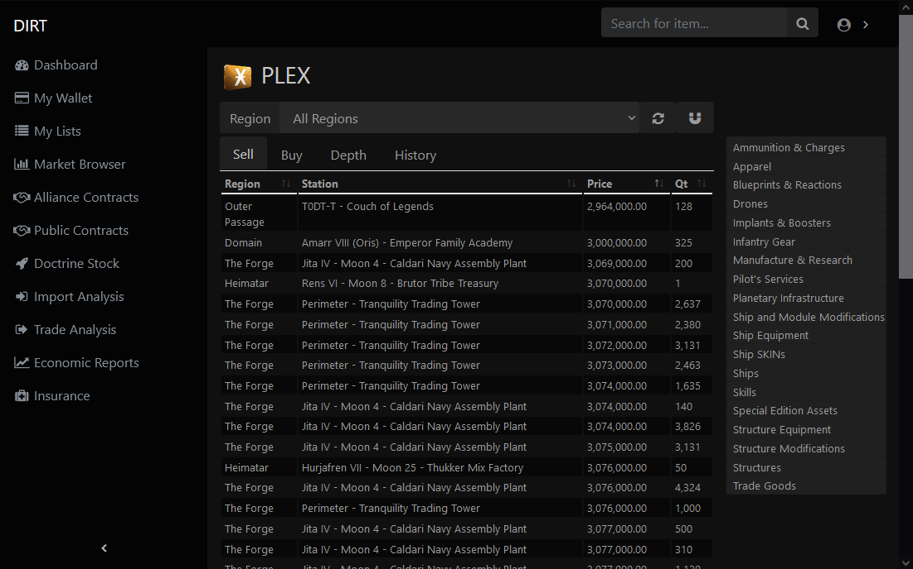
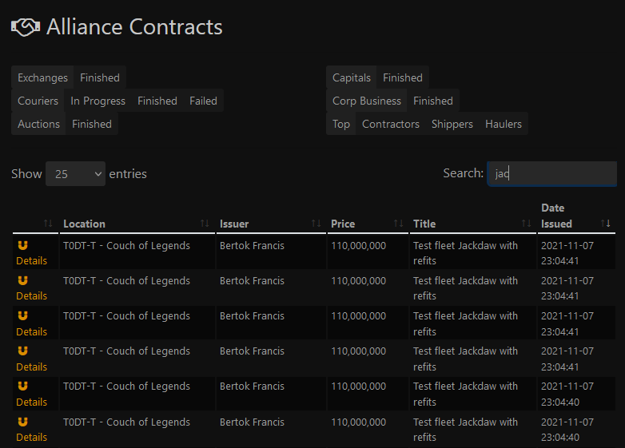
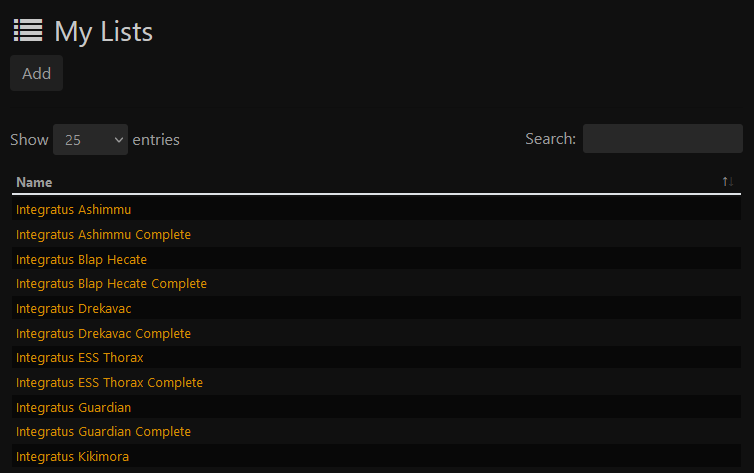
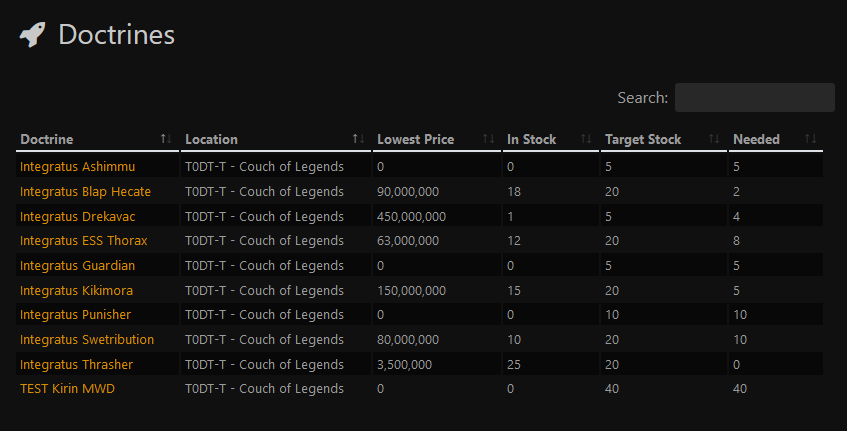
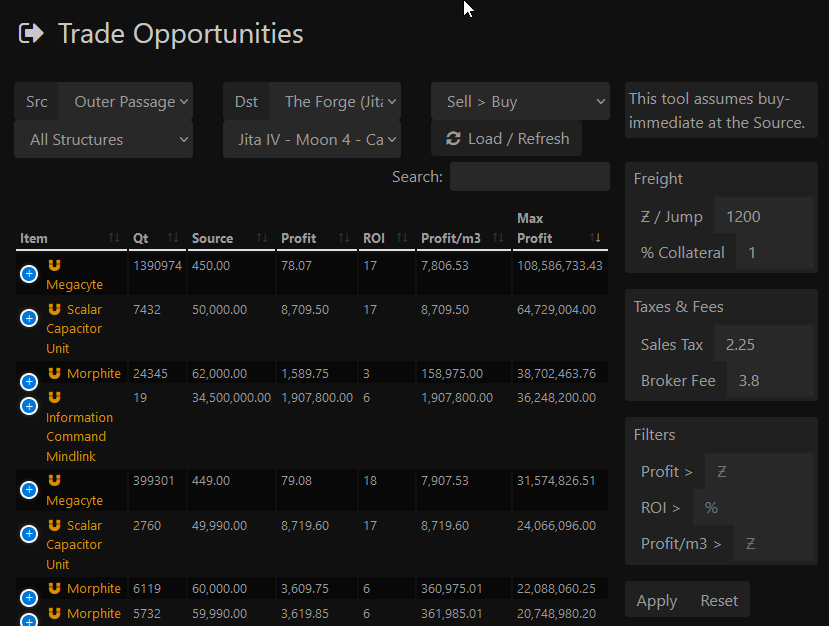
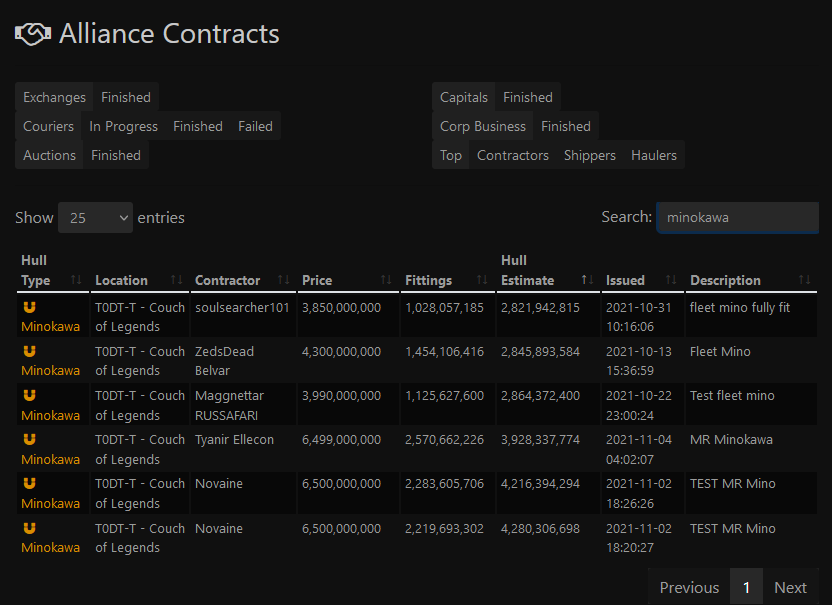
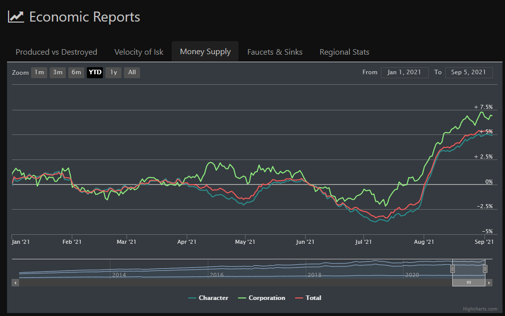

# dirt-web
Front-end application for analysis and reporting of market data for EVE Online trading. 

## Market Browser
Simple order book display with depth and history charts. Includes an accordion-style item navigation panel and the ability to view across all regions simultaneously.

## Contracts
Admittedly not as fully-featured as the in-game interface for contracts, but still adequate for locating certain things. It has special queries for looking at the top contractors and freight services to keep an eye on the competition.

## List Management
Intended for keeping track of particular combinations of items, such as standardized ship fits.

Lists are an input to the Doctrine Stock tool which provides an up-to-date report on the availability of doctrine contracts, allowing rapid assessment of the supply chain and military readiness.

## Regional Trade Analysis
The original bread-and-butter of the system, the Import and Trade Analysis tools allow for the fast identification of profitable markets by exploiting price disparities between different in-game regions. Additional normalizations according to item size (which affects freight costs), taxes, and historical market demand further refines searches to help avoid items types that are inefficient to handle, experiencing temporary disruptions, or have otherwise deceptive trading characteristics. Market manipulations by other traders are also made vibrantly conspicuous with the right settings, opening further opportunities for more aggressive market PvP.

## Capital Contract Analysis
One traditionally difficult area of trading is that of capital ships. Since they cannot be moved by freighter and repackaging them destroys the often valuable rigs, they are almost exclusively traded via contracts. As a result, price transparency can become very difficult as each contract must be appraised manually and individually. With the power of a carefully built SQL query, the Capital contract tool provides an automatic, instant appraisal of *every* outstanding contract that contains a capital ship. By separately appraising the items included with the ship, contracts for the same hull class can be more directly compared. Additionally, since the ESI API allows us to view completed contracts, research can be easily conducted into historical prices for comparison.

## Monthly Economic Reports
A more dynamic view of the monthly econ data provided by CCP. I also maintain original copies of every past MER [here](https://github.com/segfault24/eve-mer).

## Other Features
* Search box provides fast navigation and helpful suggestions.
* Magnet icons trigger the open-in-game ESI endpoint to quickly get you where you need to go.
* User's market orders are automatically highlighted in the market browser.

## License
This project is released under the MIT License.

Please forgive me for using PHP